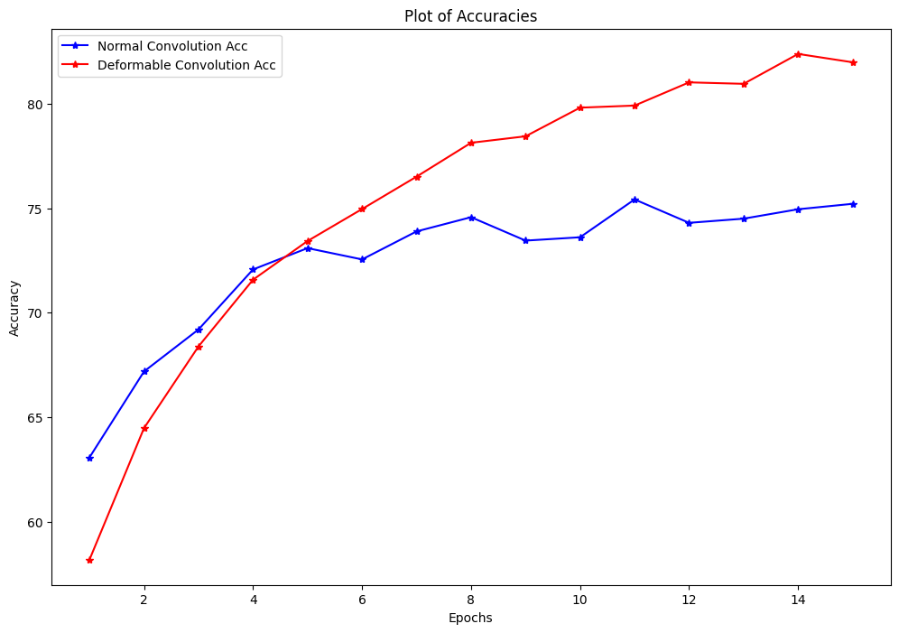

# Deformable vs Standard Convolution on CIFAR-10

This repository presents a comparison between a **Deformable Convolutional Network (DCNN)** and a **Standard Convolutional Network (CNN)** on the CIFAR-10 dataset. 
The project explores the advantages of using deformable convolutions for increased flexibility, and the impact on classification accuracy over several epochs.

### Key Highlights:
- Implementation of both DCNN and CNN from scratch using PyTorch.
- CIFAR-10 dataset used for image classification.
- Comparison of training accuracy over 15 epochs.
- A final plot illustrates the difference in performance between the two approaches.

### Final Plot:

